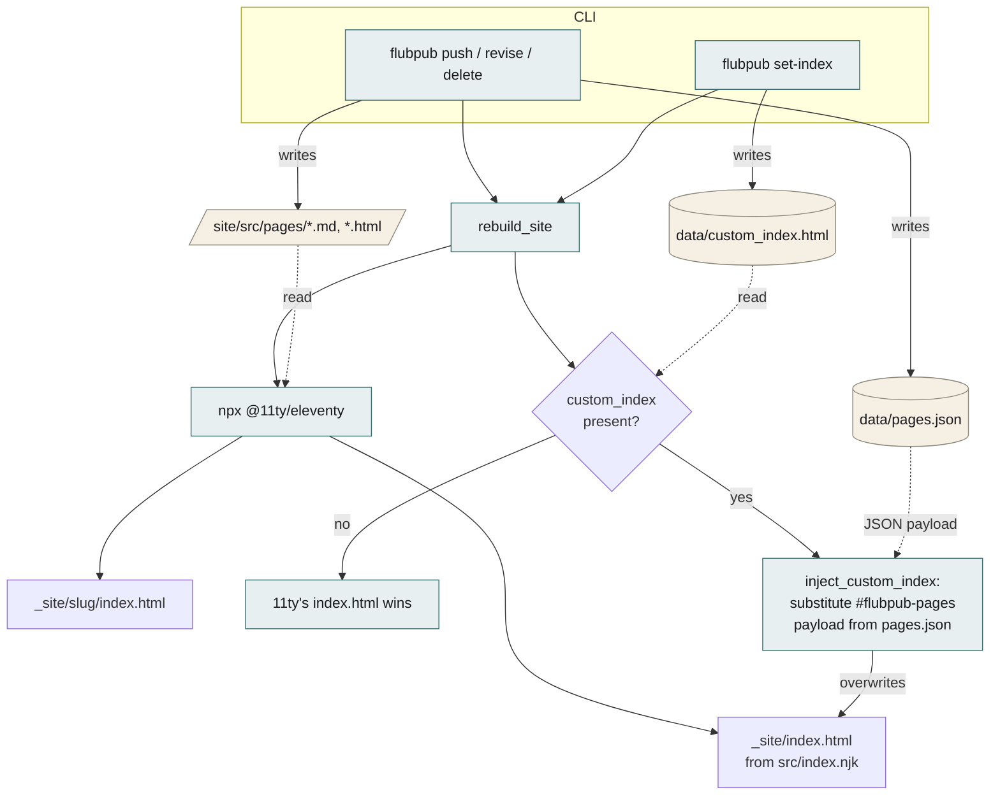
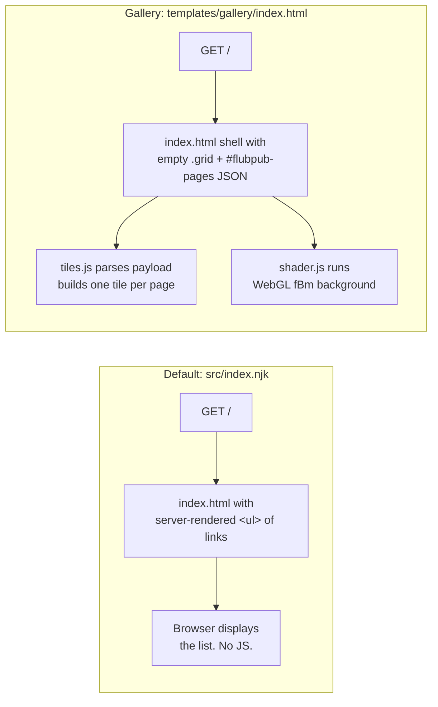

# flubpub

A personal web publishing tool — like `gh gist` but for web pages. A CLI pushes
content to a FastAPI server, which writes it into an 11ty site and triggers a
static rebuild. The result is a chronological index of published pages,
rendered either as a plain list (default) or as a shader-backed gallery of
hand-composed tiles (optional).

## Quick start

```bash
uv run flubpub serve                             # local server
uv run flubpub push page.md --title "My Page"    # publish locally
uv run flubpub set-index templates/gallery/index.html  # optional gallery front page
uv run flubpub set-index templates/gallery/index.html --vars templates/gallery/vars.bijectivity.yml  # …with branding
```

### Multi-install (one VPS, several domains)

flubpub supports running multiple installs side by side, one per domain.
Configure each as a named "site" in `~/.config/flubpub/sites.toml`, then
deploy and publish via `--site KEY`:

```bash
uv run flubpub sites add dwm root@host:/opt/flubpub-dwm \
    --server-name danielwymark.com --port 8001 --default --email you@example.com
uv run flubpub sites add bj  root@host:/opt/flubpub-bj \
    --server-name bijectivity.net --port 8002

uv run flubpub deploy --site dwm                 # stand up the install
uv run flubpub --site bj push notes.md           # publish to bj
uv run flubpub list                              # uses default site
```

The Python package contains no site-specific names — keys live entirely in
your config. `--remote root@host:/abs/path` is still available as a raw
escape hatch; `flubpub serve` still runs locally for previewing.

**TLS** is opt-in: pass `--email` to `sites add` (or set top-level
`acme_email` in `sites.toml`, or export `EMAIL`). When set, `flubpub deploy`
runs `certbot --nginx` on the remote to issue a Let's Encrypt cert, add a
443 server block, and install an HTTP→HTTPS redirect. Certbot's bundled
systemd timer handles renewal. Without an email, the site is HTTP-only.

See [`CLAUDE.md`](CLAUDE.md) for the full command surface and architecture.

## Index rendering modes

flubpub ships with two ways of rendering the site's front page: 11ty's default
Nunjucks template, and an optional custom HTML file the server patches with the
current page list at every rebuild. The mechanism is the same either way —
only the rendering mode differs.

### Rebuild pipeline

Every `push`, `revise`, `delete`, or `set-index` call triggers `rebuild_site`,
which runs 11ty and then optionally overlays a custom index on top of its
output.



### What the browser gets

The default index is fully rendered at build time. The gallery index is a
static shell that hydrates client-side from the injected JSON payload.



### Data sources, side by side

The two modes read different things. That is the core of the contrast:

| Aspect | Default (`index.njk`) | Gallery (custom index) |
| --- | --- | --- |
| Data source | Filesystem: `site/src/pages/*.md`, `*.html` (11ty's `collections.pages`) | Metadata: `data/pages.json`, injected as JSON into `#flubpub-pages` |
| Render time | Build time (Nunjucks, server-side) | Page load (JS, client-side) |
| Sees per-page metadata? | Only frontmatter fields 11ty reads | All of `pages.json`: `theme`, `color_scheme`, `content_type`, `tile`, timestamps |
| Output shape | `<ul>` in a 700px column via `base.njk` | Square tile grid + shader canvas |
| Customization | Edit `src/index.njk` / `_includes/base.njk` and redeploy | Edit `templates/` files and re-run `set-index` |
| Per-post tile metadata | Not applicable | Optional `tile: { accent, svg, kicker, tags }` on page entries |
| Revert | Git revert | `flubpub unset-index` |

### Configuration knobs

Where each tunable lives:

| Knob | Location | Effect |
| --- | --- | --- |
| Which pages appear | `data/pages.json` (managed by CLI) | Source of truth in both modes |
| Sort order | `server.py:inject_custom_index` | Fixed to `created_at` desc |
| Masthead / footer text | Jinja vars (`site_title`, `brand`, `tagline`, `footer_left`, `footer_right`) | Pass a YAML file via `set-index --vars path.yml`; see `templates/gallery/vars.bijectivity.yml` for an example |
| Template structure (markup itself) | `templates/gallery/index.html` | Edit + re-run `set-index` |
| Per-tile accent, SVG, kicker, tags | `tile: {…}` on a page's entry in `pages.json` | Optional; defaults fill in when absent |
| Fallback monogram + accent-from-slug-hash | `templates/gallery/tiles.js` | Edit + re-run `set-index` |
| Shader, tile chrome, grid min-width (260px) | `templates/gallery/index.css`, `templates/gallery/shader.js` | Edit + re-run `set-index` |
| Revert to default | `flubpub unset-index` | Deletes `custom_index.html`; 11ty output wins again |

The key architectural distinction: the default index is a build artifact of
11ty's view of the filesystem; the gallery is an overlay the flubpub server
stamps on top of that build, parameterized by runtime JSON. That's why the
gallery can expose per-post tile metadata without teaching 11ty about it, and
why `unset-index` is a clean rollback — nothing in `site/` ever changed.
